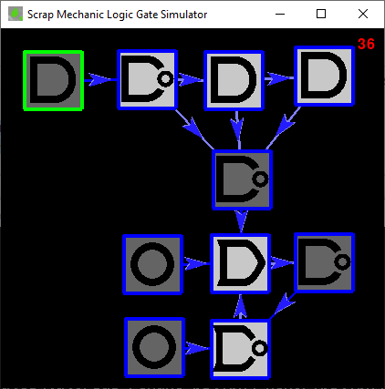

# Scrap Mechanic Logic Gate Simulator/Debugger

This is a python app that will allow you to debug your Scrap Mechanic circuits.  It doesn't reach into the game at all - you have to duplicate your prototype here in the game and all that, but this gives you a chance to see what your circuit will do tick-by-tick.  It's particularly pointed at helping get over the pain induced by the tick-by-tick nature of how Scrap Mechanic works and the wonkiness that can happen when you load in.

This app would really be far better as a web application and done by somebody with some more advanced graphic arts skills than I have.  I did it with python and pygame because I wanted to learn that stack to be able to help my son with it in his own stuff.  The code's not going to win any awards for outstanding object oriented design either.  Feel free to flex on me by rewriting it!

## Installation

Sorry if this is a bit technical, but my guess is that if you're versed enough to use Scrap Mechanic's
logic gates productively, then you've probably already got some basic chops, so...  Here goes.

1. Install Python
2. Clone this project
3. Run ```python3 -m pip install -U pygame --user```
4. Run ```python3 smlogic.py mycircuit.json```

That will start up the app.  It'll be just a black screen.

Your work will be saved to `mycircuit.json`.

## Quick Start

You can probably figure this out with just this information. First off, there's a command-line argument ("mycircuit.json" above).  It gets loaded on start (if it's there) and written when you exit.  You can also save in the middle with "s", but I'm not sure if that's really useful.  If you don't supply that command line argument, it'll save to a file called `smlogicsim.json`.

The main window works with a combination of mouse and keyboard; the gestures are as follows:

`L` - place a logic gate centered on the mouse cursor

`I` - Place an input gate centered on the mouse cursor

`T` - Place a 10-tick timer centered on the mouse cursor

`left-mouse-button drag` - make a connection between two blocks

`shift-left-mouse-button-drag` - move a block

`F5` - Start the simulator running

`F6` - Pause the simulator

`F10` - Run the simulator for a single "tick"

`F4` - Reset the simulator.  This simulates unloading and re-loading scrap mechanic.  If you don't know why that's a crucial thing, skip down to the "Glitches" section below.

`Shift-F4` - Completely clear the circuit including clearing timers.  In the game, this can only be done by taking an object off of the lift.

Gates with a white background indicates it's in the "True" state and those with a gray background are in the "False" state.  Connections can be light blue or dark blue, and they indicate what the state of the input object was at the start of the tick.  You use that color to understand why the logic gate is in the state that it's in.

If you didn't quite get that, here's the dance-remix.  Note that all the pictures you see here have accompanying pre-built circuits.  They're in the `tutorials` folder.

## Tutorial

### Let's Add some stuff

There are three kinds of things in the simulator - "logic gates" and "timers" are pretty much
identical to your experience in scrap mechanic.  Then there's the "input", which takes the place
of buttons, switches and sensors.  They're just a manual way for you to provide a signal to your
network.

To get a feel for it, we'll first create a simple line of logic gates.  To do that, click in the
field of the app (just to make sure it's got your input focus).  Then move it to the left side
of the screen and type "i" (the letter "i" on your keyboard). That will drop an "input" object
on the screen.  Then move your cursor to the right a bit and type "g" to drop a logic gate, making
sure to space them apart a bit so it's easier to see.

If you're not happy with your layout, you can move stuff around by holding down the shift key
and dragging the gates where you want them to be.  You can also delete one by selecting it
(clicking on it until the surrouding box turns green instead of blue) and pressing the "delete"
key on your keyboard.

That should leave you something like this:


Next we want to make connections.  To do this, hold your mouse over the "input" block (the one with
the circle in it) then press the mouse button down, drag the mouse over to the leftmost logic gate
and release it.  That'll form a connection from the button to the logic gate.  It's like scrap mechanic:
if you want to delete a link, repeat the gesture.  If you want to reverse the direction, drag from the
other way.  That should leave you with this:


So what we've got is a series of "And" gates connected to a button.  You can liven things up by
changing the and gates.  To do that, click on one of the gates to select it and then press
the arrow keys on your keyboard.  Left and Right toggle through "and", "or" and "xor" and up
and down toggle whether it's notted.  For the "Input" gate (the circle thing) arrow keys of
either sort will toggle it between an input that is currently off and one that is currently on.

If you've played much Scrap Mechanic, you'll know that logic gates are pretty quick, but they're
not instant.  Unless your gaming rig is pretty mighty, if you built this circuit in scrap mechanic,
you could observe how clicking the button causes the gates to light up in a wave -- not all at once.

To see the effect in the simulator, press "F5" on your keyboard to start the simulation running.  The number in the upper-right corner is counting the ticks since the last reset.  If it's actively increasing, your simulator is running.  To pause it, you can press "F6", but let it run for now.

Select the input button at the left and turn it on and off (by pressing an arrow key) and observe how the signal travels through the network.

## How Scrap Mechanic works

### Ticks

You might have heard the word "ticks" before.  In the context of computer gaming, it usually refers to the processing of a single "frame" of the game.  If you're familiar with the term FPS - frames per second, that's a frequency or a rate.  The "Tick" is basically the period of time between frames.  With that background, we can understand how scrap mechanic processes circuits, because it doesn't just analyze a long chain connections and compute its results in a single tick.

Why doesn't it?  Well, pretty much all the really interesting circuits in scrap mechanic involve feedback loops and the scrap mechanic devs knew that was going to be a thing.  With loops, there is no single answer to compute because the whole circuit cycles between states over time.  So it's not like on each frame the whole chain gets computed instantly - it just can't work like that.

So what they do is basically this:  They make a copy of the the state of every gate and input in an object, then they go around computing the new state of every logic gate _based on the old state_ that was recorded earlier.

In the simulator, that old, recorded state is reflected in the color of the connection lines.  Light Blue means that, prior to the next tick, the input was True.

To illustrate this, run the simulator, set the input object to "On" and let the signal percalate through the network, then pause it (with `F6`).  Here we see all the gates are white (meaning they are True) and all the connections are likewise true.  If you select the Input button at the left and change it to false (with, an arrow key), you'll see the gate itself turns gray, but the input signal is still light blue (reflecting how it was at the start of the tick).  If you press F10 to single step, you'll see the line and the subsequent gate go dark.

The way you want to think about it is this:  _The color of the inputs will always explain the current state of the gate_.  The state of a gate will flow down the wire to the next gate, _but on the next tick_.

### Glitches - Logic Gates

Most folks who go to the trouble of installing this thing and reading this far have done so because they just can't figure out why their machine behaves wonkily and they want to really square it up.  Some of that wonky behavior comes from our own goofs, but a good part of it comes down to this:

Scrap mechanic does not store the state of logic gates when you save and exit the game or unload a chunk or take a build off of the lift.  That means that every logic gate is outputing false for the very first tick after loading.

> Actually, I think I'm not putting that correctly.  I believe is that what's not getting stored is that "between-tick" state I mentioned before in the implementation.  That is, all of the *inputs* to the logic gate are treated as false on the first tick.  In any case the simulator seems to be doing the same thing as scrap mechanic in terms of that first tick, as best as my experiments were able to prove.


If you've built anything of any complexity in SM, you've probably built this simple memory circuit because you saw it on YouTube and saw the youtuber extoll it as "perfect!" but when you run it, it's not.  You likely saw right away that it flashes wildly until you press one button or the other.  If you single step through with the simulator, you can do the math and see why that is.  If it's in a stable state, it cooperates, but it can also get into an unstable state.  You can also destabilize it by sending it a really short input signal (1 or 2 ticks long).  Again, you can see why it happens if you step through the simulator.

### Glitches - Timers

Strictly speaking, I don't know of any glitch with timers themselves, that's because, unlike logic gates, their states _are_ persisted.  But if you've ever built a repeating timer, you probably noticed that this happens:


It should be the case that timer is just periodically on and off depending on the duration of the timer but somehow we get these random puffs mixed in there, like the random 0 bit flowing through the bottom timer in the picture above.  How does that happen?

Well, it's because it doesn't store the state of the logic gate and, for the first tick after loading, it's false even though the not gate should be making it true.  You can see this effect in the simulator by doing this:

1. Completely reset the simulator by pressing `Shift-F4`.
2. Press F5 to start the simulator rolling.
3. At some point while the logic gate is sending out a "True" signal, press `F4` to simulate an unload event.
4. Press `F5` to resume it.

You can replicate this in scrap mechanic pretty easily too - just exit the game while the logic gate is true.  When you reload, you'll see that annoying blip start flowing through your timer.

## Glitch-Proofing Our Stuff

There's no general recipe for this, really.  For example, the memory bit will glitch out if its input signals are too short or it gets overlapping signals.  Maybe that'll never happen in your circuit because your inputs are coming from sensors that just won't trigger that fast.

### 3-Tick Pulse Extender

In my survival world, I have an automated farm.  I push a button and a giant arm pushes water cannons and seed-spewing pumps across the land.  One it starts going I can walk away from it and know it'll complete its cycle.  It can do this because of a memory bit that gets set in response to the button click.  Trouble is, if I don't hold the button long enough, it doesn't work.  Whatever can we do?


Notice that the top button is not protected, and can cause the memory bit ot spaz out if you turn it on and off quickly.  But the bottom one is not, simply because it lets the signal walk through some extra gates to extend its effective duration.  Single step through to see it in action.

### Load-In Detector

Suppose we want to do something on load in to compensate for the mucked up state of our circuit.  Here's a circuit that pits the weapons of our enemies against them!



Here the normal state would be that all of the inputs to the second row would naturally be true all the time, _except when we're loading in_, where they will be false until the top-left nand gate's signal reaches them.

To make this practical, I've tied the signal to a memory bit - so this is a memory bit that will reset itself automatically on reload and not spaz out.  Well, that's not quite true, as you can see if you step through it - it does become set for two ticks before settling back to unset.

I bet a clever person could weed that out of the system if it caused mayhem in their build.

### Solid-State Memory

What if you want a memory bit that keeps its state even after you unload and reload?  As we showed above, we can get a signal that fires when we reload, and we've also pointed out that timers do retain their state across reload.  So, to put the two together, we can build this:


Basically instead of sending the on-reload signal directly to the reset pin, we're routing it to either the set or the reset pin depending on what's flowing out of the timer.

Note that you need to set up your timer so that it's at least 5 ticks long in the game.  (Alas, in the simulator all timers are hard-coded to 10 ticks because lazy.)

### Timer Wiper

I think everybody except ScrapMan uses piston-powered crushers on a timer to defend their farm.  It's just far and away the cheapest and most maintenance-free way to do it.  The trouble is I can't be bothered to turn the system on and off; I just leave it running all the time.  That means that it's all the time got those stray bits running through it and every once in a while I've gotta hold down a reset button to sweep it all out.

It's tiresome and embarassing.  What can we do?  Well, there are probably some clever ways to do it, but we could also hit it with the load-detector hammer.  This circuit causes it to basically completely reset the timer every time you load in.

Note that I'm chaining timer circuits together here, but in the game it'd be silly not to just use a single timer, programmed with a longer duration than your main circuit's timers.


## Issues and contributing

I don't know how much more effort I'll be willing to put into this, but if you think it could be better in some way, feel free to add an Issue.  The [todo.md](todo.md) page has my own personal ideas of what could be added to make it better.  But if you want to move the needle, send in a pull request!
