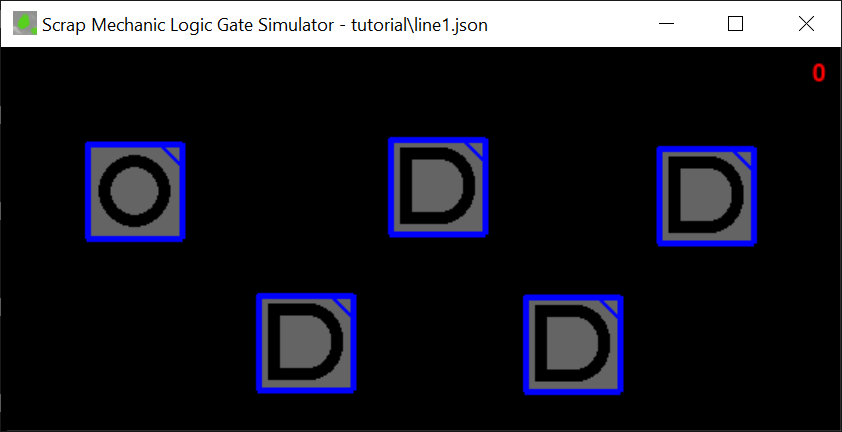
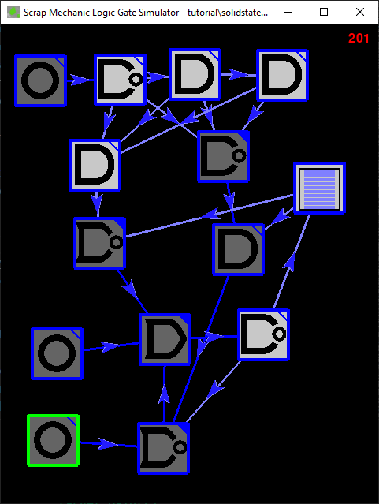
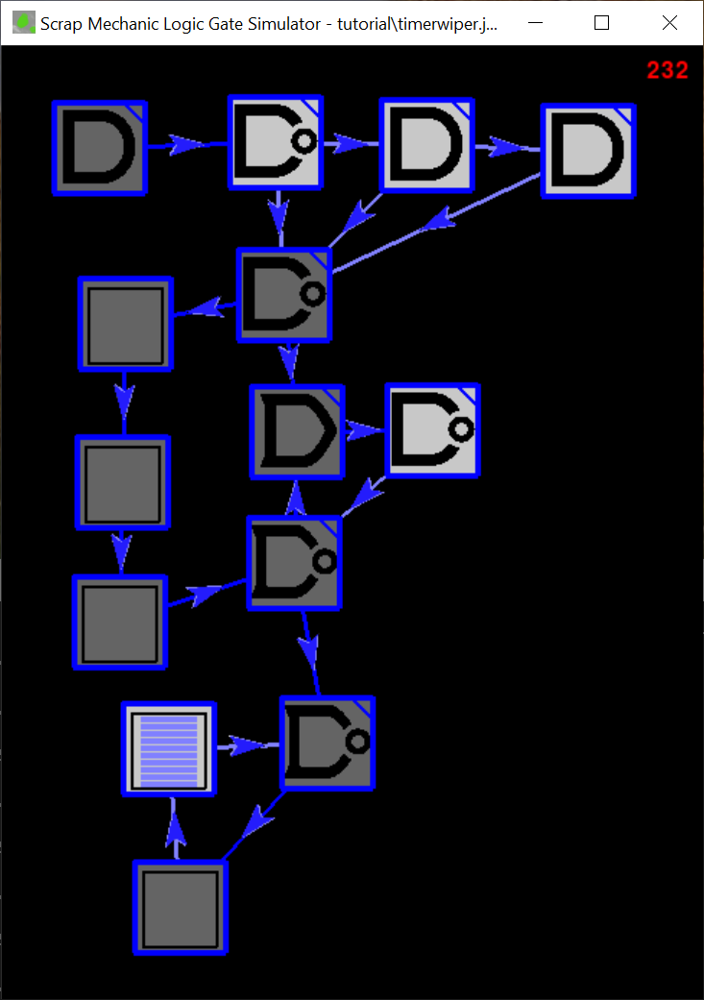

# Scrap Mechanic Logic Gate Simulator/Debugger

This is a python app that will allow you to debug your Scrap Mechanic circuits.  It doesn't reach into the game at all - you have to duplicate your prototype here in the game and all that, but this gives you a chance to see what your circuit will do tick-by-tick.  It's particularly pointed at helping get over the pain induced by the tick-by-tick nature of how Scrap Mechanic works and the wonkiness that can happen when you load in.


This app would really be far better as a web application and done by somebody with some more advanced graphic arts skills than I have.  I did it with python and pygame because I wanted to learn that stack to be able to help my son with it in his own stuff.

## Installation

Sorry if this is a bit technical, but my guess is that if you're versed enough to use Scrap Mechanic's
logic gates productively, then you've probably already got some basic chops, so...  Here goes.

1. Install Python
2. Clone this project
3. Run ```python3 -m pip install -U pygame --user```
4. Run ```python3 smlogic.py mycircuit.json```

That will start up the app.  It'll be just a black screen.

Your work will be saved to `mycircuit.json`.

## Quick Start

You can probably figure this out with just this information. First off, there's a command-line argument ("mycircuit.json" above).  It gets loaded on start (if it's there) and written when you exit.  You can also save in the middle with "s", but I'm not sure if that's really useful.  If you don't supply that command line argument, it'll save to a file called `smlogicsim.json`.

The main window works with a combination of mouse and keyboard; the gestures are as follows:

`L` or `G` - place a logic gate centered on the mouse cursor

`I` - Place an input gate centered on the mouse cursor

`T` - Place a 10-tick timer centered on the mouse cursor

`left-mouse-button drag` - make a connection between two blocks

`shift-left-mouse-button-drag` - move a block

`F5` - Start the simulator running

`F6` - Pause the simulator

`F10` - Run the simulator for a single "tick"

`F4` - Simulate unloading and re-loading scrap mechanic.  If you don't know why that's a crucial thing, skip down to the "Glitches" section below.

`Shift-F4` - Completely clear the circuit including clearing timers.  In the game, this can only be done by putting an object on the lift.  It sets the saved state of every logic gate, and switch to `Off` and erases the memory of timers.

`P` - Simulate painting a logic gate or button (which saves the state of the selected switch or logic gate).  This has no effect on timers.

`Shift-P` - Simulate taking a the build off of the lift (which has the effect of saving the state for every control).  This has no effect on timers.

Gates with a white background indicates it's in the "True" state and those with a gray background are in the "False" state.  Connections can be light blue or dark blue, and they indicate what the state of the input object was at the start of the tick.  You use that color to understand why the logic gate is in the state that it's in.  It doesn't signify anything that's visible in-game.

If you didn't quite get that, here's the dance-remix.  Note that all the pictures you see here have accompanying pre-built circuits.  They're in the `tutorials` folder.

## Tutorial

### Let's Add some stuff

There are three kinds of things in the simulator - "logic gates" and "timers" are pretty much
identical to your experience in scrap mechanic.  Then there's the "input", which takes the place
of buttons, switches and sensors.  They're just a manual way for you to provide a signal to your
network.

To get a feel for it, we'll first create a simple line of logic gates.  To do that, click in the
field of the app (just to make sure it's got your input focus).  Then move it to the left side
of the screen and type "i" (the letter "i" on your keyboard). That will drop an "input" object
on the screen.  Then move your cursor to the right a bit and type "g" to drop a logic gate, making
sure to space them apart a bit so it's easier to see.

If you're not happy with your layout, you can move stuff around by holding down the shift key
and dragging the gates where you want them to be.  You can also delete one by selecting it
(clicking on it until the surrouding box turns green instead of blue) and pressing the "delete"
key on your keyboard.

That should leave you something like this:



Next we want to make connections.  To do this, hold your mouse over the "input" block (the one with
the circle in it) then press the mouse button down, drag the mouse over to the leftmost logic gate
and release it.  That'll form a connection from the button to the logic gate.  It's like scrap mechanic:
if you want to delete a link, repeat the gesture.  If you want to reverse the direction, drag from the
other way.  That should leave you with this:


So what we've got is a series of "And" gates connected to a button.  You can liven things up by
changing the and gates.  To do that, click on one of the gates to select it and then press
the arrow keys on your keyboard.  Left and Right toggle through "and", "or" and "xor" and up
and down toggle whether it's notted.  For the "Input" gate (the circle thing) arrow keys of
either sort will toggle it between an input that is currently off and one that is currently on.

If you've played much Scrap Mechanic, you'll know that logic gates are pretty quick, but they're
not instant.  Unless your gaming rig is pretty mighty, if you built this circuit in scrap mechanic,
you could observe how clicking the button causes the gates to light up in a wave -- not all at once.

To see the effect in the simulator, press "F5" on your keyboard to start the simulation running.  The number in the upper-right corner is counting the ticks since the last reset.  If it's actively increasing, your simulator is running.  To pause it, you can press "F6", but let it run for now.

Select the input button at the left and turn it on and off (by pressing an arrow key) and observe how the signal travels through the network.

## How Scrap Mechanic works

### Ticks

You might have heard the word "ticks" before.  In the context of computer gaming, it usually refers to the processing of a single "frame" of the game.  If you're familiar with the term FPS - frames per second, that's a frequency or a rate.  The "Tick" is basically the period of time between frames.  With that background, we can understand how scrap mechanic processes circuits, because it doesn't just analyze a long chain connections and compute its results in a single tick.

Why doesn't it?  Well, pretty much all the really interesting circuits in scrap mechanic involve feedback loops and the scrap mechanic devs knew that was going to be a thing.  With loops, there is no single answer to compute because the whole circuit cycles between states over time.  So it's not like on each frame the whole chain gets computed instantly - it just can't work like that.

I'm not privvy to the SM code, but I've run quite a few experiments to prove that this is an effective way to understand the algorithm:

First off, you have to think of each connection as having a state, either On or Off.  It then goes through each logic gate and calculates what the gate's state should be, based on the state of the "wires".  After it's done that calculation for **all** the gates, it sets the state of the wires based on the current state.  Now, I kinda doubt they actually attach state to the wires like I said.  More than likely they do it like in the simulator, where there's a "previous" state and they read that "previous" state.

In the simulator, that old, recorded state is reflected in the color of the connection lines.  Light Blue means that, prior to the next tick, the input was True.

To illustrate this, run the simulator, set the input object to "On" and let the signal percalate through the network, then pause it (with `F6`).  Here we see all the gates are white (meaning they are True) and all the connections are likewise true.  If you select the Input button at the left and change it to false (with, an arrow key), you'll see the gate itself turns gray, but the input signal is still light blue (reflecting how it was at the start of the tick).  If you press F10 to single step, you'll see the line and the subsequent gate go dark.

The way you want to think about it is this:  _The color of the inputs will always explain the current state of the gate_.  The state of a gate will flow down the wire to the next gate, _but on the next tick_.  You might think "Wait!  That's now how Scrap Mechanic Works!" and there's some truth to that, but if the circuit is in a stable state, there's no difference between what's "in the wire" and the gate itself.  The simulator is meant to help you with _unstable_ circuits, and so it takes the time to show you this nuance.

### Loading - Logic Gates and Switches

Most folks who go to the trouble of installing this thing and reading this far have done so because they just can't figure out why their machine behaves wonkily and they want to square it up.  For example, if you create the ubiquitous NOR-flip-flop memory circuit, you'll find that it can do some odd things when you load back into the game or when you come back to your base from afar.  Sometimes the circuit is as you left it.  Sometimes it's completely spazzing out, and sometimes it's in a different state than when you left it.

Why would that be?  Surely you'd think that Scrap Mechanic would save the current state of your circuits when it unloads a block and reload that state when you load the game back up or return from some distant land in your car.  But no.  It doesn't work like that.  That would make a lot of sense.  That's the way I think I'd make it work, but this is Scrap Mechanic, and it is as it does.  It saves the state of your logic gates and switches at a few magic times:

1. When you take it off the lift.
2. When you change the nature of the gate (e.g. switch from an "AND" to a "NOR" gate).
3. When you attach or detach an input or output (using the connect tool).
4. When you paint it.

Note that this business of taking things off the lift saving state is also true for switches!  Try this:  bolt a light and a switch together on the lift, connect the switch to the light, flip the switch on, then take the thing off the lift.  Light's still on.  Turn the switch off.  Exit.  When you load back in, observe that the switch is on again!  Put it on the lift, turn it off, take it off the lift, turn it on, exit, come back and lo, the switch is off.  Same thing for painting the switch:  turn it on, paint it, turn it off, exit, come back and boom, it's on again.

The saved state is signified by the triangle in the upper-right corner of logic gates and switches in the simulator.  A filled in triangle means it's saved state is `On` and an empty triangle is `Off`.

One thing to note about the simulator and saved state is the simulator lets you do some stuff that's not practically possible in the game because it lets you pause the game.  If you're trying to replicate a sequence of moves in the simulator that you're going to do in the game, only use `P` (save the state) when the circuit is actually at a stable state.  (That is, pressing `F10` doesn't change the `On` / `Off` state of your circuit.)

### Loading - Timers

Unlike logic gates and switches, Timer states _are_ stored when you exit as they are in the game when you unloaded and not, like logic gates, like they were when they were on the lift.  This is also true for state-ful interactables like pistons and controllers.  E.g. if you hook a button up to a controller and a piston, then flip the button on, exit, and come back, you'll find your piston retracting and your controller un-spinning.  That is, on-load, they were in their extended/rotated state, but as soon as they loaded back in, the signal they get from the switch (which flipped itself off on reload) is telling them to retract.

That brings its own brand of mischief to the table.  If you've ever built a repeating timer, you probably noticed that this happens:


It should be the case that timer is just periodically on and off depending on the duration of the timer but somehow we get these random puffs mixed in there, like the random 0 bit flowing through the bottom timer in the picture above.  How does that happen?

It's because of the logic gate.  In this case, it came off the lift with the logic gate "on", so when load in, it's momentarily "on" again until it reads data from the timer.  To reproduce this in the simulator:

1. Completely reset the simulator by pressing `Shift-F4`.
2. Press F5 to start the simulator rolling.
3. At some point while the logic gate is sending out a "True" signal, press `F4` to simulate an unload event.
4. Press `F5` to resume it.

You can replicate this in scrap mechanic pretty easily.  Create a timer circuit like this on the lift.  Remove it from the lift when the NAND gate is lit.  Then exit the game when the NAND gate is not lit and come back.  Poof.

## Glitch-Proofing Our Stuff

Making a glitch-proofer for the load-in thing requires a fair bit of care.  We'll start with something really basic and then work our way through to fixing the timer glitch and creating a memory-cell that remembers its state even on reload.

### 3-Tick Pulse Extender

In my survival world, I have an automated farm.  I push a button and a giant arm pushes water cannons and seed-spewing pumps across the land.  Once it starts going I can walk away from it and know it'll complete its cycle.  It can do this because of a memory bit that gets set in response to the button click.  Trouble is, if I don't hold the button long enough, it doesn't work.

To reproduce the problem in the simulator, create a simple memory circuit, like this:


Start it running, toggle one of the inputs on until the circuit stabilizes, then turn it off.  Now, turn on the other input for just one or two ticks and see, we've destabilized the circuit.  Same thing happens in Scrap Mechanic if you don't hold the button down long enough.

Whatever can we do?


Notice that the top button is not protected, and can cause the memory bit to spaz out if you turn it on and off quickly.  But the bottom one is safe, simply because it lets the signal walk through some extra gates to extend its effective duration.  Single step through to see it in action.

It's a really trivial thing, but you'll see it quite a bit, so be sure you fully grok it before moving on.

### Building a Load-In Detector In the Game

Given that our circuitry can get out of kilter on reload, it'd be a good thing if we could make a circuit that will detect this condition and allow us to recover from it.

Making this happen in the game is tricky, and more than a little bit frustrating if you haven't learned the rules for exactly when it saves things.  Let's walk through exactly how to do it by building a demonstration circuit.  Here's what we're building:


The connections are plain-jain one-to-the-next. Here's another view:


Here are some things to pay special attention to when recreating this:

1. It is on the Lift
2. There's a switch, and _it must be turned **ON**_!
3. The first timer is 10 seconds, and is just there to sort of buffer the signal while you're getting your bearings after loading.  Adjust as you desire.
4. The next two timers are set to 9 ticks - which is a handy thing because there are 10 bars on the side of the timer, so you can see the wave-form well.  Why 9 and not 10?  Note that you _can_ make a "0 tick" delay - but if you string a series of 0-tick timers in a line, you'll see the signal travel through them, just like it does for a logic gate.  When scrap mechanic says there's a 0-tick delay, they mean a 0-tick delay over and above the 1-tick delay that every interactable gets.  Anyway, the 9-tick timers are in a loop so you can watch it better.  It's important, because if you're just learning this stuff, you'll ask "did I really just see that???!" more than once.git st

Take it off the lift now, exit and come back, and it'll be in exactly this state.  Another interesting exercise is to flip the switch off, wait for the timers, and reload.  Observe that the timers have retained their content, but the switch and the logic gates are all as they were.

So far, we don't have a loading detector, do we?  Let's do magic:

1. _Do this while it's laying on the ground and **not** on the lift!_
2. Delete the switch.
3. Replace it with a button.
4. Reconnect it to the NAND gate.  (The magic is done at this point - the rest is just to let you see it better.)
5. Allow the timers to drain.
6. Swap the OR gate (the one stuck out on the glass block) to AND.
7. Drain out the 10-tick timers.
8. Put it back to OR.

You should see this now:


When you log out and log in again, payday:


Keen-eyed observers might ask, why is it 3 ticks long when we have a 4-gate chain?  Well, the thing to know is that right after we load, the logic gates will be in the state they were in way back up at the first screenshot.  That's because in that screenshot they were on the lift.  That's the state that is imposed on the logic gates when you reload, with one crucial exception: the NAND gate at the front of the chain.  Because we messed with its inputs when we replaced the switch with a button.  Now its remembered state is _not_ what it was on the lift, but rather right after we attached the button.

To underline the point, try this:  change the last AND gate in the chain to an OR.  Should change nothing, right??  Well, log back out and back in again:


Let's go over in detail why we see two bars:  The first bit that heads into the timers comes from the NAND gate.  That was last touched when it was on the lift, and it was in the ON state then, so the first bit that hits the timer is `True`.  The next guy in the chain is from the AND gate that was turned into an OR, and it was ON when it was twiddled, so the ON gets translated by the NAND gate into a `False` so we get an empty slot in our timer.  Next, we get the untouched AND gate, which was OFF when it was on the lift.  So that flows into the newly-made OR gate and stays the same, then goes on into the NAND gate and gets turned into a `True` heading into the timer.  Finally, there's the NAND gate at the front of the stack, and it became ON when we attached the button, so it flows to the final NAND gate as a `True` and therefor sends a `False` tick to the timer.  And, of course, every subsequent tick it stays `False` for the same reason.

### The Load-detector in the simulator

You can walk through this in the simulator stepwise to see the same effects happen in slo-mo.  You'll find tutorial\loadsignal.json is ready for you - it's got the circuit built and in the state it'd be when it's on the lift.


Take it off the lift with `Shift-P`.  When you do that, the only change you will see are the colored triangles that indicate the saved state changing to reflect their current state.

If you then do the "magic" steps discussed above (deleting the switch and re-adding it, and so on), you get this:


Notice how the NAND gate's save state changed after we reconnected the now OFF input gate.  It's also crucial to note that the save state of the three subsequent gates is the opposite of their current state.  When you press `F4` (to simulate a reload) and press `F5` (to start the simulator running), you get the effect we observed in the game.

### Solid-State Memory

What if you want a memory bit that keeps its state even after you unload and reload?  As we showed above, we can get a signal that fires when we reload, and we've also pointed out that timers do retain their state across reload.  So, to put the two together, we can build this:



Note the load-in detector circuit like before, and remember that when you build these things, you have to prime it a bit.  Here's how you can simulate the priming of this one:

  1. Press `Shift-F4`
  2. Press `F5`  -- now you've got it on the lift and it's jittering wildly.
  3. Turn the input in the top-left on and let it stabilize.
  4. Press `Shift-P` to simulate taking it off the lift.
  5. Turn the switch in the top left off and paint it with `P`

The output of the on-reload signal gets paired with the content of the timer (which is what's remembering the saved state) and routed to either the set or the reset pin.

Note that you need to set up your timer so that it's at least 5 ticks long in the game.  (Alas, in the simulator all timers are hard-coded to 9/10 ticks.)

### Timer Wiper

I think everybody except ScrapMan uses piston-powered crushers on a timer to defend their farm.  It's just far and away the cheapest and most maintenance-free way to do it.  The trouble is I can't be bothered to turn the system on and off; I just leave it running all the time.  That means that it's all the time got those stray bits running through it and every once in a while I've gotta hold down a reset button to sweep it all out.

It's tiresome and embarassing.  What can we do?  Well, there are probably some clever ways to do it, but we could also hit it with the load-detector hammer.  This circuit causes it to basically completely reset the timer every time you load in.

Note that I'm chaining timer circuits together here, but in the game it'd be silly not to just use a single timer, programmed with a longer duration than your main circuit's timers.



There's more than one way to do this.  In my own game, I didn't implement it like this.  I built a circuit that detects a `True-False-True` sequence to initiate the wipe rather than the on-load event.  Further, you oftentimes don't actually need solid state memory.  For example, in my farm I have memory-cells that is true when the planter is moving forward and false when it's moving backwards or parked.  I simply put the memory cell into the "parked" state and painted it at that time.  That works more than fine - I'm very, very unlikely to ever exit or unload the game while the planter is in motion.  I dare say that's true for most stuff.  An elevator might be an example of something where you'd really want a solid-state circuit, but you could also get that effect by other means (e.g. a floor-sensing detector).

## Issues and contributing

I don't know how much more effort I'll be willing to put into this, but if you think it could be better in some way, feel free to add an Issue.  The [todo.md](todo.md) page has my own personal ideas of what could be added to make it better.  But if you want to move the needle, send in a pull request!
